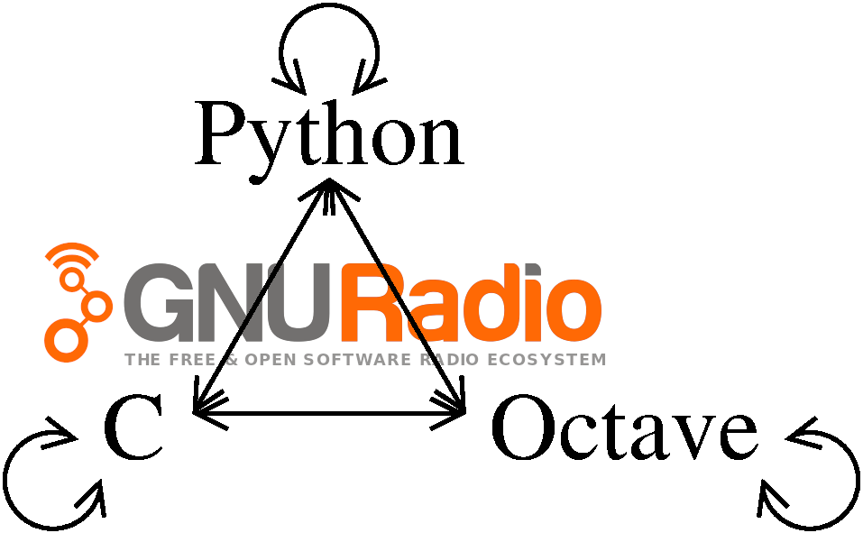

# GNU Radio Communication

Communication between GNU Radio, Python and GNU Octave through TCP, UDP, 0MQ, XMLRPC...

The objective is to demonstrate how GNU Radio efficiently benefits from external tools
for either completing processing (streaming from GNU Radio pre-processing to external
tools) or for external tools to control the flowgraph behaviour.

